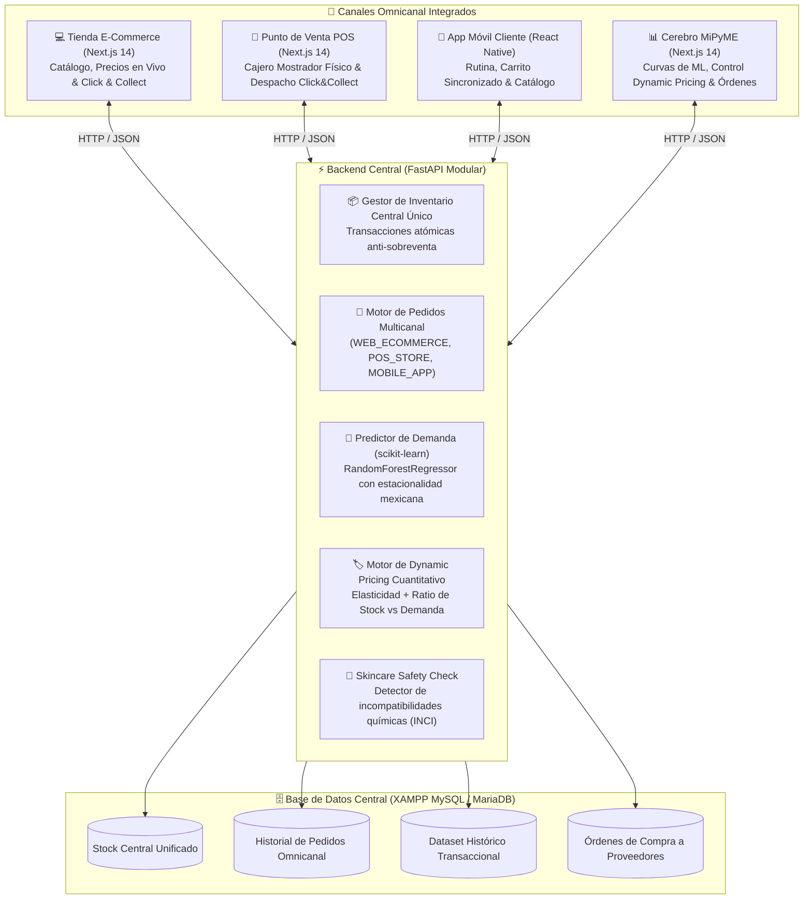

# NÁCAR · SkinHub Omnicanal & Cerebro Digital de E-Business

> **HackaTec 2026 · Etapa Regional · Tecnológico Nacional de México**  
> *"Dynamic pricing, predicción de stock mediante machine learning, omnicanalidad integrada y escalamiento de mercado a la web para MiPyMEs."*

---

## 🌟 Resumen Ejecutivo del Proyecto

Las MiPyMEs cosméticas y de retail en México enfrentan dos causas principales de mortandad prematura:
1. **Quiebres de stock y sobreinventario**: falta de predicción científica de la demanda, lo que atrapa liquidez o provoca pérdida de ventas frente a gigantes del e-commerce.
2. **Falta de omnicanalidad**: vender en canales separados (tienda física, web, app) provoca sobreventas ("vender dos veces la última pieza"), discrepancias de precios y carritos desconectados.

**Nácar** resuelve este problema convirtiéndose en el **Cerebro Digital de la MiPyME**, integrando:
- **Predicción de Demanda con Machine Learning Real (`scikit-learn`)**: proyecta las ventas a 14 y 30 días, calcula la fecha exacta de agotamiento (*Runout Date*) y automatiza órdenes de reabastecimiento (*ROP*).
- **Motor de Dynamic Pricing Cuantitativo**: correlaciona la velocidad de demanda de ML con el nivel de stock en tiempo real (eleva margen en escasez y liquida con descuento en sobrestock), propagando precios en vivo a todos los canales.
- **Omnicanalidad Total con Inventario Único**: un único stock centralizado que atiende simultáneamente la Tienda Web, la Terminal de Punto de Venta (POS) físico y la App Móvil en React Native.
- **Logística Híbrida Click & Collect**: permite a los clientes comprar online y retirar inmediatamente en mostrador de la tienda física.

---

## 🏗️ Arquitectura Técnica



---

## 🧠 Núcleo de Inteligencia: Cumplimiento del Reto

### 1. Predicción de Stock con Machine Learning Real (`scikit-learn`)
- Implementado en `backend/app/ml/demand_forecaster.py` mediante un `RandomForestRegressor`.
- Entrenado con más de **3,200 transacciones omnicanal históricas** con estacionalidad semanal, quincenas mexicanas (días 15 y 30) y elasticidad de precio.
- **Outputs Operativos**:
  - Curva de demanda proyectada a 14 días.
  - **Runout Date**: cálculo de días restantes antes del quiebre.
  - **Punto de Reorden (ROP)**: genera automáticamente la orden de compra a proveedores con la cantidad óptima.

### 2. Motor de Dynamic Pricing en Tiempo Real
- Implementado en `backend/app/ml/dynamic_pricing.py`.
- **Estrategia Scarcity Premium**: si un producto tiene inventario crítico y alta demanda predicha por ML, eleva el precio entre `+8%` y `+15%` para capturar margen y frenar la velocidad de quiebre.
- **Estrategia Excess Stock Clearance**: si un producto tiene sobrestock (>35 días de inventario), activa un descuento dinámico del `-10%` al `-20%` para liberar flujo de caja, respetando siempre el margen de costo de la MiPyME.
- Al activarse, el nuevo precio se actualiza al segundo en la Web, la App y el POS físico.

---

## 🚀 Guía de Ejecución Local para la Demo

### 1. Iniciar Backend FastAPI (Puerto 8000)
Abre una terminal y ejecuta:
```bash
run_backend.bat
```
O directamente con PowerShell:
```powershell
cd backend
.\venv\Scripts\python -m uvicorn app.main:app --reload --port 8000
```
> La API estará disponible en `http://localhost:8000` y la documentación interactiva en `http://localhost:8000/docs`.

### 2. Iniciar Plataforma Web Next.js (Puerto 3000)
Abre otra terminal y ejecuta:
```bash
run_web.bat
```
O con npm:
```powershell
cd web
npm run dev
```
> Abre tu navegador en `http://localhost:3000`.

---

## 🎬 Guión de Demostración para los Jueces (3 Minutos)

1. **Mostrar la Omnicanalidad y Stock Único (1 min)**:
   - Abre la pestaña de **Tienda E-Commerce** (`http://localhost:3000`) y observa el stock del *Tónico BHA* (ej. 8 piezas).
   - En otra ventana o pestaña, abre el **Punto de Venta POS** (`http://localhost:3000/pos`).
   - Realiza una venta en el POS de 2 unidades cobrando en efectivo.
   - Regresa a la tienda web y refresca: el stock ha bajado automáticamente a 6 piezas. ¡Cero sobreventa!
2. **Demostrar Click & Collect (30 seg)**:
   - En la Tienda Web, agrega un producto al carrito, ve a `/cart` y selecciona **Click & Collect (Recoger en Tienda)**.
   - Confirma el pedido.
   - Ve al POS (`/pos`) a la pestaña **Click & Collect**: verás el pedido listo para entrega con un botón para entregarlo al cliente en mostrador.
3. **Demostrar el Machine Learning y Dynamic Pricing (1.5 min)**:
   - Entra al **Cerebro MiPyME** (`http://localhost:3000/admin`).
   - Muestra la gráfica de **Recharts** con el histórico vs la **curva predicha por scikit-learn** (resaltando los picos de quincena y fines de semana).
   - Muestra el **Runout Date** y el botón para **Generar Orden de Compra Automática**.
   - En la tabla de **Dynamic Pricing**, muestra cómo el algoritmo detectó escasez en el *Sérum Retinol* y sobrestock en el *Limpiador de Ceramidas*, y presiona el botón **"Aplicar Precios Dinámicos a Todos los Canales"**.
   - Vuelve a la tienda o POS para comprobar que los nuevos precios están activos al segundo.
